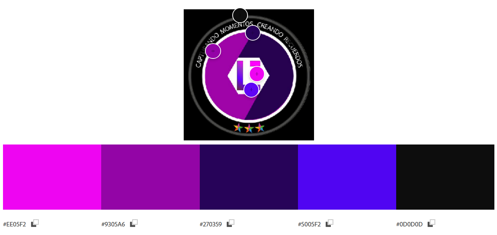
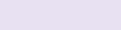
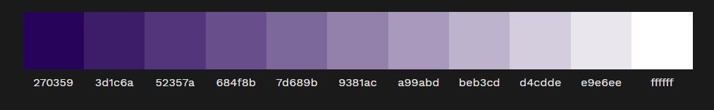

# EVR PRODUCCIONES

buscador de YouTube:

> navbar con bootstrap para movil [link](https://youtu.be/h5apE3E72wY?si=UCs5gUdk5W0luFz0)

## PROCESO UI - UX

1) **SKETCH**
    * Boceto General.
    * LLuvia de Ideas.

    ### Mapa de sitio

    > 1. inicio
    > 1. nosotros
    > 1. servicios
    > 1. galeria-> portafolio
    > 1. Testimonios
    > 1. contactos.

2) **WIREFRAMES _(OPCIONAL)_** 
    * indicadores: figuras geométricas, textos descriptivos.

3) **LAYOUT**
    * Diseño Grafico Estático.
    * Guias de Estilo.
    > colores: en nuestro caso vamos a usar para la armonia de colores: Personalizado (la triada, tonos o compuestos). _-NO PUEDE FALTAR LOS COLORES NEUTROS COMO NEGRO, GRIS Y BLANCO-_

    **ESTRACCION DE COLORES(TEMA)**

    

    

    de la cual solo voy a escojer el color más llamativo que lo utilizaré para botones y enlaces  y el color oscuro para fondo y títulos.
    
    **COLOR PARA FONDO**

    > en este caso voy a usar el color principal como tiente, es decir que: mesclaré (90% blanco + 10% #270359) como resultado obtengo: #F4F0F9
    

    > otra opción es usar un (80% blanco + 20% #270359) es un poco más perceptible. #E8E1F2
    

    Hay una herramienta para generar más tintes como este: [ LINK: Tint & Shade Generator](https://maketintsandshades.com/)
    

    Ideal para fondos minimalistas que no compitan con el contenido.

    ## RECOMENDACION DE LA IA:

    ¡Excelente pregunta! En diseño web **menos es más**. Una paleta bien estructurada suele tener entre **3 a 5 colores máximo** para mantener coherencia y evitar saturación visual. Aquí te detallo cómo distribuirlos en tu landing page para filmación de eventos:

---

### **Estructura ideal de colores** (basada en estándares de diseño UI/UX):  
1. **Color principal (1 tono):**  
   - Ejemplo: `#270359` (morado oscuro de tu logo).  
   - **Uso:** Encabezados, botones principales, barras de navegación.  
   - *Representa la identidad de tu marca*.

2. **Color secundario (1-2 tonos):**  
   - Ejemplo: `#EE05F2` (magenta de tu logo) + `#FFD700` (dorado opcional).  
   - **Uso:** Botones secundarios, íconos, acentos interactivos (hover, subrayados).  
   - *Aporta contraste y jerarquía*.

3. **Color de fondo (1-2 variantes):**  
   - Ejemplo: `#F4F0F9` (tinte claro de tu morado) + blanco puro (`#FFFFFF`).  
   - **Uso:** Fondos de secciones, tarjetas, espacios negativos.  
   - *Debe ser neutral para no competir con el contenido*.

4. **Colores neutros (2 tonos):**  
   - Ejemplo: `#333333` (gris oscuro) + `#777777` (gris medio).  
   - **Uso:** Texto corporal, bordes, elementos discretos.  
   - *Garantizan legibilidad y equilibrio*.

---

### **Ejemplo práctico para tu agencia:**  
| Rol del color       | Código HEX   | Uso típico en la landing |  
|----------------------|--------------|--------------------------|  
| **Principal**        | `#270359`    | Logotipo, botón "Ver demo", títulos. |  
| **Secundario**       | `#EE05F2`    | Botón "Contactar", hover effects. |  
| **Fondo claro**      | `#F4F0F9`    | Fondo de secciones "Portafolio". |  
| **Neutro oscuro**    | `#333333`    | Texto de párrafos. |  
| **Neutro claro**     | `#FFFFFF`    | Fondo de header/formularios. |  

---

### **Reglas clave:**  
- **60-30-10:** Distribuye los colores en proporciones:  
  - 60% fondo (neutro).  
  - 30% color principal.  
  - 10% color secundario (para destacar acciones).  
- **Accesibilidad:** Asegura contraste mínimo de **4.5:1** entre texto/fondo (usa [WebAIM Contrast Checker](https://webaim.org/resources/contrastchecker/)).  
- **Consistencia:** Usa la misma paleta en todas las páginas de tu sitio.  

---

### ¿Qué evitar?  
- Más de **2 colores vibrantes** (ej: magenta + dorado + azul neón).  
- Fondos con texturas o patrones complejos que distraigan.  
- Colores puros (#FFFFFF o #000000) en grandes áreas (usa tintes como `#F8F9FA` o `#121212`).  

Si tu logo ya tiene varios colores (como el magenta y morado), **repítelos en la web** para reforzar identidad, pero siempre con moderación.  

¿Necesitas ayuda para aplicar esto en un diseño concreto? ¡Puedo sugerirte un esquema visual! 🎨

4) **PROTOTIPO FUNCIONAL (OPCIONAL)**
    * Simula las Interacciones

5) **PROGRAMACIÓN**
    * Código (Nativo, Escritorio o Web)

    

**PROYECTO:**

**Landing Page de EVR**
- Version Mobile.
- Version Tablet.
- Version Desktop.

> POR HACER : DISEÑAR EL SITIO PARA PC, NOS GUIAMOS DE LAS PLANTILLAS.

Es como una card horizontal [card-horizontal?](https://getbootstrap.com/docs/5.1/helpers/stretched-link/#identifying-the-containing-block)

al encabezado podemos darle un blur: 'backdrop-filter: blur(0.2rem)'

---
https://chat.deepseek.com/a/chat/s/8de3410d-c517-4ebf-8fa8-c0c5ee21fb04

---

Fondo muy claro (10-15% de tu color):

#F4F0F9 (90% blanco + 10% #270359)

Ideal para fondos minimalistas que no compitan con el contenido.

---

Fondo ligeramente perceptible (20-30%):

#E8E1F2 (80% blanco + 20% #270359)

Perfecto si quieres que el tono morado se note sutilmente.

--- 

Fondo medio (40%):

#D7C9E6 (60% blanco + 40% #270359)

Para un look más artístico pero sin saturar.