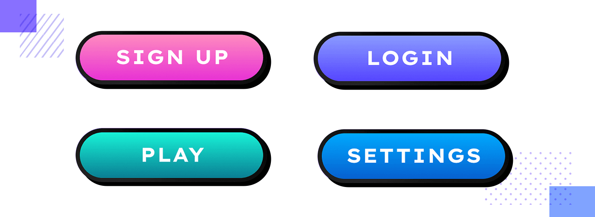

# EVR PRODUCCIONES

buscador de YouTube:

> navbar con bootstrap para movil [link](https://youtu.be/h5apE3E72wY?si=UCs5gUdk5W0luFz0)

## PROCESO UI - UX

1) **SKETCH**
    * Boceto General.
    * LLuvia de Ideas.

    ### Mapa de sitio

    > 1. inicio
    > 1. nosotros
    > 1. servicios
    > 1. galeria-> portafolio
    > 1. Testimonios
    > 1. contactos.

2) **WIREFRAMES _(OPCIONAL)_** 
    * indicadores: figuras geométricas, textos descriptivos.

3) **LAYOUT**
    * Diseño Grafico Estático.
    * Guias de Estilo.
    > colores: en nuestro caso vamos a usar para la armonia de colores: la triada.
    

4) **PROTOTIPO FUNCIONAL**
    * Simula las Interacciones

5) **PROGRAMACIÓN**
    * Código (Nativo, Escritorio o Web)

**PROYECTO:**

**Landing Page de Portafolio - CV**
- Version Mobile.
- Version Tablet.
- Version Desktop.

Es como una card horizontal [card-horizontal?](https://getbootstrap.com/docs/5.1/helpers/stretched-link/#identifying-the-containing-block)

al encabezado podemos darle un blur: 'backdrop-filter: blur(0.2rem)'
